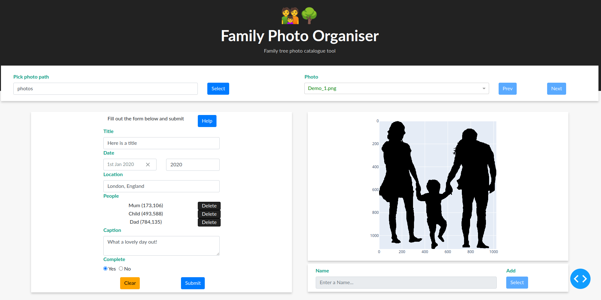

<br />
<p align="center">
  <a href="https://github.com/sephwalker321/PhotoOrganiser">
    
  </a>

  <h3 align="center">Family Photo Organiser</h3>
</p>


<!-- TABLE OF CONTENTS -->
<details open="open">
  <summary>Table of Contents</summary>
  <ol>
    <li>
      <a href="#about-the-project">About The Organiser</a>
      <ul>
        <li><a href="#built-with">Built With</a></li>
      </ul>
    </li>
    <li>
      <a href="#getting-started">Getting Started</a>
      <ul>
        <li><a href="#prerequisites">Prerequisites and Installation</a></li>
      </ul>
    </li>
    <li><a href="#run">Run</a></li>
    <li><a href="#usage">Usage</a></li>
    <li><a href="#license">License</a></li>
    <li><a href="#contact">Contact</a></li>
  </ol>
</details>


<!-- ABOUT THE PROJECT -->
## About The Project

<p align="center">
  <a href="https://github.com/sephwalker321/PhotoOrganiser">
    
  </a>
</p>


The Dashboard is designed to allow for quick navigation and cataloguing of family photos.

### Built With

The Dashboard was constructed using the following libraries and tools,
* [Dash](https://plotly.com/dash/)
* [Bootstrap](https://getbootstrap.com/)
* [Python](https://www.python.org/)


<!-- GETTING STARTED -->
## Getting Started

To get a local copy up and running follow these simple example steps.

### Prerequisites and Installation

This is an example of how to list things you need to use the software and how to install them.
1. Clone the repo,
   ```
   git clone https://github.com/sephwalker321/PhotoOrganiser
   ```

2. Running the install script,
   Linux:
   ```
   ./install_Linux.sh
   ```
   Windows:
   ```
   install_Windows.bat
   ```

3. Source the virtual environment,
   Linux:
   ```
   source venv/bin/activate
   ```
   Windows:
   ```
   venv\Scripts\activate
   ```
Alternatively see *requirements.txt* and install manually. 
<!-- RUN EXAMPLES -->
## Run
To start up server use run the python script.

1. Run,
   ```
   python app.py
   ```
   
The following comand line options are,
*  *--local*

  True: Run with local access to server only
  False: Run with network assess
	
  Default: True

  IP address in both cases are printed to terminal
*  *--port*

  int: Port number to be used
  
  Default: 8050
*  *--debug*

  True: Enable Flask debug mode
  False: Disable Flask debug mode

  Default: False
  
<!-- USAGE EXAMPLES -->
## Usage

1. Select the album folder using the ```Pick photo path``` text box or button

2. Select the photo using the ```Photo``` dropdown, "Prev" or "Next" button to navigate between them

3. It is now possible to fill out photo metadata for the photo,
  * ```Title```: Type in the textbox
  * ```Date```: Type in the textbox to select a year, the pick from the datepicker
  * ```Location```: Type in the textbox 
  * ```People```: Click on the photo and use ```Name``` textbox below the image then ```Add```. People can be removed using the ```Delete``` button
  * ```Caption```: Type in the textbox
  * ```Complete```: Tick the tick box, completed photos are coloured green in the dropdown and uncompleted marked in amber
  
4. When happy the ```submit```button will save the metadata to an excel file located in the ```Pick photo path``` directory. 

```Clear``` will empty the form so the user may start afresh.

<!-- LICENSE -->
## License

Distributed under the MIT License. See `LICENSE` for more information.


<!-- CONTACT -->
## Contact

For any issues or questions contact Joseph Walker at j.j.walker@durham.ac.uk.

Project Link: [https://github.com/sephwalker321/PhotoOrganiser](https://github.com/sephwalker321/PhotoOrganiser)


<!-- ACKNOWLEDGEMENTS -->
## Acknowledgements

 Demo photo can be found at [HERE](http://clipart-library.com/clip-art/2-25443_silhouette-child-drawing-family-computer-icons-silhouette-people.htm)
 
 Placeholder photo can be found at [HERE](https://clipartix.com/family-tree-clipart-image-24755/)
